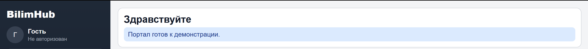
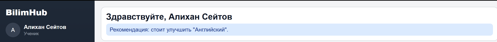
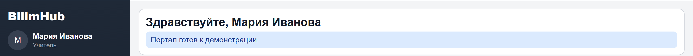

# [BilimHub - Интеллектуальная экосистема Aqbobek Lyceum](https://eskendir-dev.github.io/BilimHub/)

**BilimHub** - школьный веб-портал, разработанный в рамках хакатона **AIShack 3.0**. [Ссылка](https://eskendir-dev.github.io/BilimHub/) на сайт.


---

## Содержание

- [О проекте](#о-проекте)
- [Тестовые аккаунты](#тестовые-аккаунты)
- [Функциональность](#функциональность)
- [Роли и доступы](#роли-и-доступы)
- [Технологии](#технологии)
- [Быстрый запуск](#быстрый-запуск)
- [Запуск без Git](#запуск-без-git)
- [Локальная база данных](#локальная-база-данных)
- [Сброс состояния](#сброс-состояния)
- [Проектная информация](#проектная-информация)

---

## О проекте

BilimHub решает задачу единого цифрового пространства школы.  
В системе реализованы модули для:
- учебной деятельности (оценки, рекомендации),
- организационной работы (расписание, кружки),
- коммуникации (чат),
- администрирования (публикации, модерация заявок, статистика).

Проект работает в автономном демо-режиме:
- без внешнего backend,
- без внешней БД,
- с сохранением данных в браузере.

---



---

## Тестовые аккаунты

| Роль | Email | Пароль |
|---|---|---|
| Ученик | `student9a@school.kz` | `123456` |
| Родитель | `parent9a@school.kz` | `123456` |
| Учитель | `teacher.math@school.kz` | `123456` |
| Администрация | `admin@school.kz` | `123456` |
| Киоск | `kiosk@school.kz` | `123456` |

---

## Функциональность

### 1) Аутентификация и регистрация
- Вход по Email/паролю.
- Регистрация с выбором роли.
- Для роли **Родитель** обязательно указание почты ученика.

### 2) Лента новостей
- Доступна всем ролям.
- Реакции на посты (лайки).
- Для **Администрации**:
  - публикация;
  - редактирование;
  - удаление.

### 3) Оценки
- Формат таблицы: `Предмет | КР | Сор1 | Сор2 | Соч`.
- Отображение в формате `балл/макс.балл`.
- Учитель может редактировать оценки по выбранному классу.

### 4) Кружки
- Ученик: подписка/отписка.
- Родитель: просмотр кружков ребенка.
- Учитель: просмотр своих кружков + заявка на новый кружок.
- Администрация: подтверждение/отклонение заявок.

### 5) Расписание
- Администрация обновляет расписание:
  - по ссылке;
  - через файл.
- Пользователи видят расписание по своим правам:
  - ученик — своего класса;
  - родитель — класса ребенка;
  - учитель — своих класс��в;
  - киоск — всех классов.

### 6) Чат
- Доступен ролям: Ученик, Учитель, Администрация.
- Ограничения:
  - обычные пользователи не пишут администрации;
  - администрация пишет только учителям.
- Поддерживается блок “Недавние чаты”.

### 7) Профиль
- Просмотр роли, имени, класса, почты.
- Редактирование имени и аватара.
- Выход из аккаунта.

### 8) Рекомендации
- Для ученика формируется подсказка по предмету, требующему усиления (на базе mock-оценок).

---

## Роли и доступы

| Роль | Лента | Оценки | Кружки | Расписание | Чат | Аккаунт | Спец. права |
|---|---|---|---|---|---|---|---|
| Ученик | ✅ | ✅ | ✅ (подписка) | ✅ (свой класс) | ✅ | ✅ | Лайки, рекомендации |
| Родитель | ✅ | ✅ (ребенка) | ✅ (просмотр) | ✅ (класс ребенка) | ❌ | ✅ | Привязка к ученику |
| Учитель | ✅ | ✅ (редактирование) | ✅ (свои + заявки) | ✅ (свои классы) | ✅ | ✅ | Заявки кружков |
| Администрация | ✅ | ❌ | ❌ | ✅ (все + редактирование) | ✅ (только с учителями) | ✅ | Управление новостями и заявками |
| Киоск | ✅ | ❌ | ❌ | ✅ (все классы) | ❌ | ✅ | Публичный режим |

---

## Технологии

- **React**
- **Vite**
- **JavaScript (ES6+)**
- **CSS**
- **Mock API (`mockServer.js`)**
- **localStorage** для сохранения состояния

---

## Быстрый запуск

### Требования
- Node.js (рекомендуется LTS)
- npm

### Запуск
```bash
git clone [https://github.com/eskendir-dev/BilimHub.git](https://github.com/eskendir-dev/BilimHub.git)
cd BilimHub
npm install
npm run dev
```

После запуска откройте адрес из терминала (обычно `http://localhost:5173`).

---

## Запуск без Git

Если Git не установлен:

1. Откройте страницу Release проекта на GitHub.
2. Скачайте архив **BilimHub-v1.0.zip**.
3. Распакуйте архив в любую папку.
4. Откройте терминал в папке проекта.
5. Выполните:
```bash
npm install
npm run dev
```

---


---


## Локальная база данных

В проекте используется:
- mock-данные из `mockServer.js`,
- локальное сохранение в `localStorage`.

Это означает:
- изменения сохраняются после перезагрузки страницы,
- но только в рамках текущего браузера/устройства.

---

## Сброс состояния

Если нужно вернуть проект в “чистое” состояние, откройте консоль браузера и выполните:

```js
localStorage.removeItem('bilimhub_full_hackathon_v4');
location.reload();
```

---


## Проектная информация

Проект создан в рамках **AIShack 3.0**.  
Репозиторий: **eskendir-dev/BilimHub**
